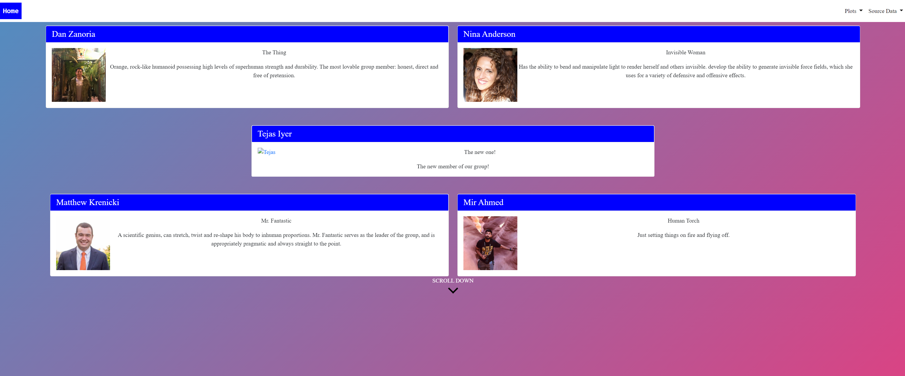
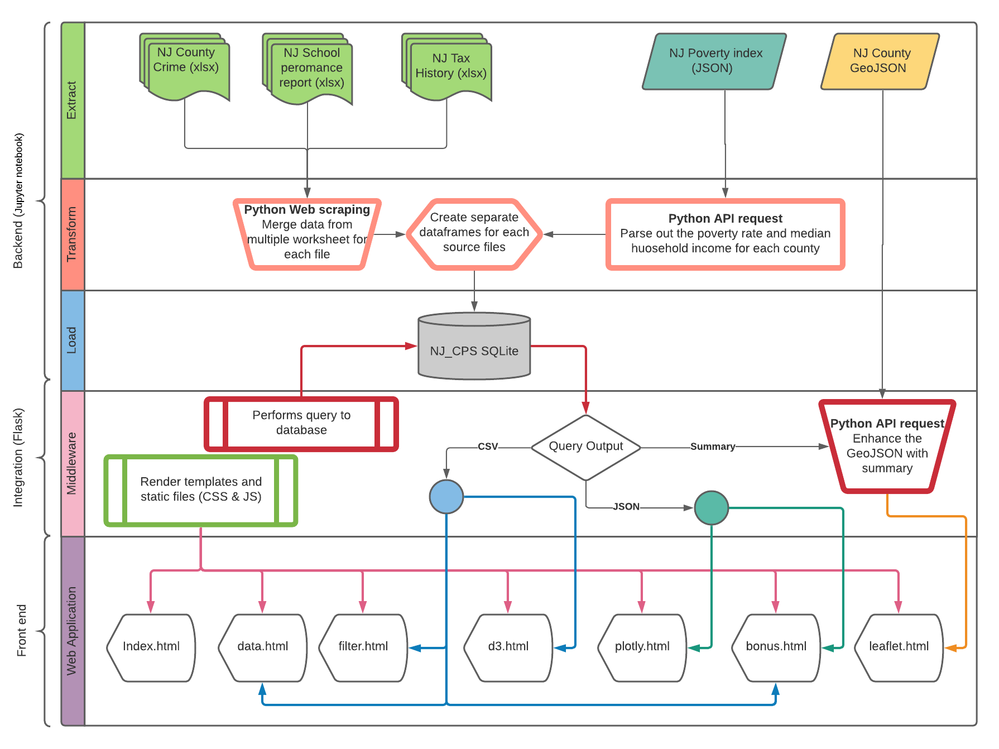

# Project 2 - NJ Movers Guide - Back Benchers

### Our Members

# Our Goals
## Our goal is to create a guide that would educate potential movers on where to live in New Jersey based on certain criteria such geography, crime rate, education level, and tax rate.

### Our Process

### Our Challenges & ### Solutions

### Our Data Sources

 #### Tax Rate
 1) https://www.state.nj.us/treasury/taxation/lpt/taxrate.shtml
 #### Tax Rate
 3) http://data.ci.newark.nj.us/dataset/new-jersey-counties-polygon/resource/95db8cad-3a8c-41a4-b8b1-4991990f07f3
 4) https://rc.doe.state.nj.us/ReportsDatabase.aspx
 5) https://www.njsp.org/ucr/current-crime-data.shtml
 6) https://api.census.gov/data/timeseries/poverty/saipe?get=NAME,SAEMHI_PT,SAEMHI_MOE,SAEPOVALL_PT,SAEPOVALL_MOE,SAEPOVRTALL_MOE,SAEPOVRTALL_PT,STABREV&for=county:*&in=state:34&YEAR=2019

Our biggest challenege from the Data sources was combining the all the different sets that would be useable for us. We had to convert the data, clean the data, synchronize key names such as country names, create a new json from Sqlite, and merge multiple json and geojsons. 

#### D3 Page
  1) The X-Axis is based on Poverty Rate, Average School Rank, House Hold Median Income
  2) The Y-Axis is based Crime Data which are Crime Rate per 100K, Total Offense, Total Arrest.
With this anyone can compare any of the X axis, and be measured against the data on the Y axis. The chart will plot the counties data based on which X and Y axis pair are activated.

#### Plotly Page
 1. Drop Down Menu is provided to select County Names which will provide general ifnformation on each County.
 2. The Horizantal Bar Chart ranks the top 10 schools per country.
 C, The Gauge Chart shows the Median Income for the county and compares it to the State Median Income. For Example Morris County has median income of $116.3k which will show a +31.2K indicating it is about $31,200 greater than the states median. Unlike Cumberland County which a m.i of 54.2k and is 31k lesser than the States.
 3. The Bubble Chart is based on the Crime Date Data. The bigger the bigger the bubble the more pronounce that particular crime is on that county compared to other crimes.
 E. With this anyone can look at this summarize page of each county and determine if they think it fits there criteria of a place to live in.
 
 #### Leaflet
  A. We went through various design iterations with the Leaflet in showing our Data. 
     1. We started off regular markers with a simple popup.
     2. We flirted with custom icons that uses Star War Images where the icons were base on the county Summative Score, and the size based on Tax Rate.
     3. We did circles where Summative Score showed color, and circle size based on Tax Rate.
  B. Finall we decided to remove the clutter and have we have on screen.
     1. Where the County Fill Color is based on the county Crime Rate per 100k. The Darker the color the higher the crime Rate
     2. The top border of the county line will show the tax rate. The lighter shade of blue will indicate a lower Tax Rate.
     3. When someone hovers on a county a summary of the general info will pop up.
  C. This page is to help a person make a decision based on the the geography and location.
  
  #### Bonus
  
